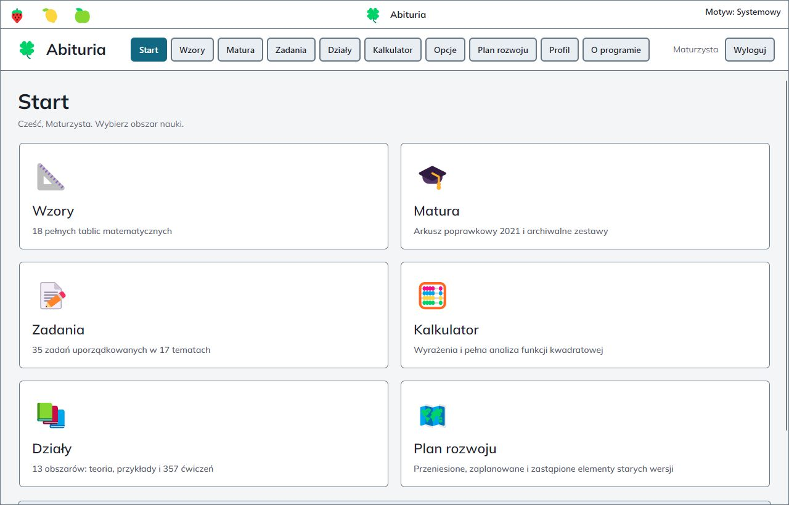
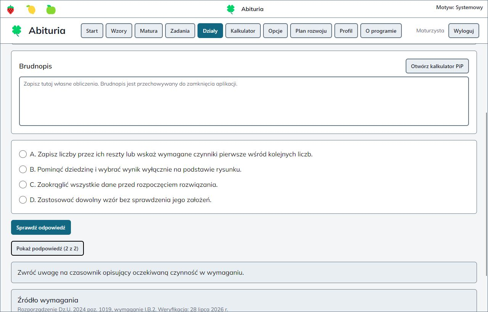
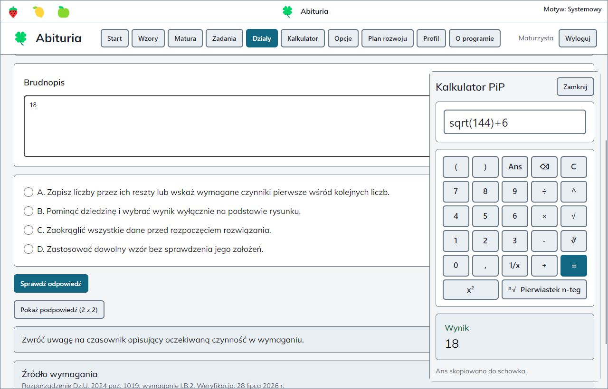
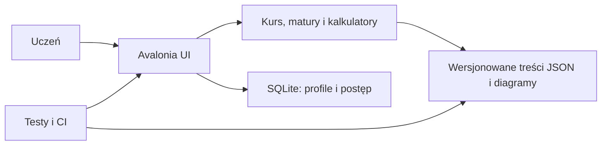

# 🍀 Abituria

**Desktopowy tutor matematyczny do nauki i przygotowania do matury - działa lokalnie, bez konta online.**

*Offline desktop mathematics tutor for Polish high-school students preparing for the matura exam.*

[](https://github.com/haribo841/Abituria/actions/workflows/build.yml)
[](https://github.com/haribo841/Abituria/actions/workflows/sonarcloud.yml)
[](https://github.com/haribo841/Abituria/actions/workflows/codeql.yml)
[](https://github.com/haribo841/Abituria/actions/workflows/pages.yml)

[**Pobierz v0.9.3**](https://github.com/haribo841/Abituria/releases/tag/v0.9.3) · [Dokumentacja](https://haribo841.github.io/Abituria/) · [Zgłoś problem](https://github.com/haribo841/Abituria/issues/new/choose)



## Pobieranie

Najszybciej zaczniesz na Windows, pobierając pojedynczy, samowystarczalny plik EXE. Instalacja środowiska .NET nie jest potrzebna.

[**Pobierz Abituria v0.9.3 dla Windows x64**](https://github.com/haribo841/Abituria/releases/download/v0.9.3/Abituria-v0.9.3-win-x64.exe)

| System | Zweryfikowana paczka | Wspierane środowisko beta |
| --- | --- | --- |
| Windows | [Pojedynczy plik EXE](https://github.com/haribo841/Abituria/releases/download/v0.9.3/Abituria-v0.9.3-win-x64.exe) | Windows 11 24H2 x64 |
| Ubuntu | [Archiwum portable](https://github.com/haribo841/Abituria/releases/download/v0.9.3/Abituria-v0.9.3-linux-x64.tar.gz) | Ubuntu 24.04 x64 |
| macOS | [Archiwum aplikacji](https://github.com/haribo841/Abituria/releases/download/v0.9.3/Abituria-v0.9.3-osx-x64.zip) | macOS 15 Intel x64 |

Wydanie beta jest niepodpisane, dlatego SmartScreen lub Gatekeeper może wyświetlić ostrzeżenie. Sumy SHA-256, bezpieczne uruchomienie i aktualizację opisuje [instrukcja instalacji](docs/INSTALLATION.md).

## Najprostszy start

1. Pobierz paczkę dla swojego systemu i plik [`SHA256SUMS.txt`](https://github.com/haribo841/Abituria/releases/download/v0.9.3/SHA256SUMS.txt).
2. Zweryfikuj sumę, a następnie uruchom EXE lub rozpakowaną aplikację.
3. Wybierz profil gościa i rozpocznij naukę. Konto online nie jest wymagane.

## Najważniejsze funkcje

- pełny kurs Formuły 2023: teoria, 238 rozwiązanych przykładów i 357 autorskich ćwiczeń;
- arkusze maturalne uporządkowane według roku, formuły i 17 tematów;
- sprawdzanie odpowiedzi, stopniowane podpowiedzi, pełne rozwiązania i postęp profilu;
- brudnopis zadania oraz kalkulator z historią, `Ans`, schowkiem i trybem Picture in Picture;
- 18 tablic matematycznych i skalowalne diagramy wektorowe;
- lokalne profile i SQLite - postęp pozostaje na urządzeniu użytkownika;
- cztery motywy, obsługa klawiatury, widoczny fokus i układ od szerokości 720 px.

## Jak wygląda nauka

1. Wybierz dział, temat albo konkretny arkusz maturalny.
2. Rozwiąż zadanie samodzielnie i odsłaniaj podpowiedzi dopiero wtedy, gdy ich potrzebujesz.
3. Sprawdź rozwiązanie, zapisz postęp i wykonaj obliczenia bez opuszczania zadania.

| Nauka krok po kroku | Kalkulator przy zadaniu |
| --- | --- |
|  |  |
| Podpowiedzi prowadzą do rozwiązania bez odbierania samodzielności. | Wynik kalkulatora można od razu wkleić do brudnopisu lub odpowiedzi. |

Zrzuty przedstawiają aktualną gałąź `main` i nie zawierają transkrybowanych treści CKE.

## Technologie i architektura

Projekt wykorzystuje **C#**, **.NET 10 LTS**, **AvaloniaUI 12**, **SQLite z Entity Framework Core**, **CSharpMath**, **xUnit**, **GitHub Actions**, **SonarCloud**, **CodeQL** i **DocFX**.



Warstwy, odpowiedzialności i przepływ danych opisuje [dokumentacja architektury](docs/ARCHITECTURE.md).

## Uruchomienie ze źródeł

Wymagany jest .NET SDK `10.0.302` przypięty w `global.json`.

```powershell
dotnet restore Abituria.sln --configfile NuGet.Config --locked-mode
dotnet run --project Abituria.csproj
```

Pełne bramki developerskie i proces publikacji opisuje [proces wydania](docs/RELEASE_PROCESS.md).

## Dokumentacja i projekt

- [Podręcznik użytkownika](docs/USER_GUIDE.md), [instalacja](docs/INSTALLATION.md) i [znane ograniczenia](docs/KNOWN_LIMITATIONS.md)
- [Analiza biznesowa](docs/BUSINESS_ANALYSIS.md), [wymagania](docs/REQUIREMENTS.md) i [architektura](docs/ARCHITECTURE.md)
- [Testy i jakość](docs/TESTING.md), [proces wydania](docs/RELEASE_PROCESS.md) i [proweniencja treści](docs/CONTENT_PROVENANCE.md)
- [Odbiór projektu](docs/acceptance/README.md), [publiczna obrona](docs/DEFENSE_PROTOCOL.md) i [kryteria oceny](docs/EVALUATION_PROTOCOL.md)
- [Współtworzenie](CONTRIBUTING.md), [wsparcie](SUPPORT.md) i [bezpieczeństwo](SECURITY.md)

Autorem i opiekunem aktualnej implementacji jest [Adam Kubiś](AUTHORS.md). Kod jest dostępny na licencji [MIT](LICENSE); prawa do materiałów edukacyjnych są ewidencjonowane osobno.

> [!NOTE]
> Najnowszym publicznym wydaniem jest `v0.9.3`. Zrzuty pokazują nowszy stan gałęzi `main`, którego manifest ma obecnie `releaseEligible=false`; przyszłe wydanie wymaga zatwierdzenia całej proweniencji. Poprzednia szczegółowa wersja strony projektu jest zachowana w [archiwum README z 2026-09-05](docs/legacy/README-2026-09-05.md).

## Kontakt i zgłoszenia

- błąd lub propozycja funkcji: [GitHub Issues](https://github.com/haribo841/Abituria/issues/new/choose);
- pytanie dotyczące użycia: [SUPPORT.md](SUPPORT.md);
- podatność lub dane wrażliwe: [SECURITY.md](SECURITY.md).
