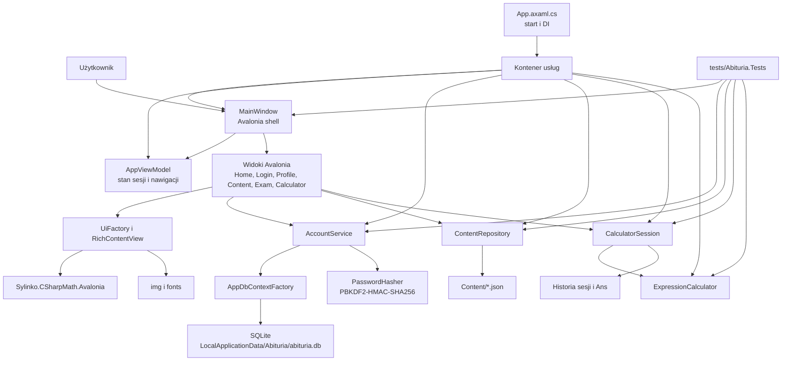

# Architektura systemu Abituria

Ten dokument opisuje aktualną architekturę aplikacji Abituria po migracji z WPF do AvaloniaUI. Historyczny opis struktury systemu pozostaje w `docs/legacy/opis-struktury-systemu.md`, ale nie jest już opisem bieżącego kodu.

## Podsumowanie techniczne

Abituria jest lokalną aplikacją desktopową `.NET 9` z interfejsem AvaloniaUI. Aplikacja działa offline, przechowuje dane kont i postęp w SQLite, a treści edukacyjne oraz dłuższe opisy interfejsu wczytuje z plików JSON umieszczonych w katalogu `Content`.

Najważniejsze decyzje architektoniczne:

- jedno główne okno `MainWindow` i nawigacja przez podmianę kontrolek `UserControl`,
- brak aktywnej nawigacji WPF, `Page`, `Frame` i `NavigationWindow`,
- ręczna kompozycja widoków w C# zamiast rozbudowanych hierarchii XAML,
- usługi aplikacyjne rejestrowane w prostym kontenerze DI z `Microsoft.Extensions.DependencyInjection`,
- lokalna baza SQLite przez Entity Framework Core,
- kalkulatory jako logika domenowa niezależna od UI,
- treści statyczne poza kodem produkcyjnym.

## Diagram komponentów

## Warstwy i katalogi

| Katalog | Odpowiedzialność | Przykłady |
| --- | --- | --- |
| `AvaloniaApp` | Kod aplikacji desktopowej | `App.axaml.cs`, `MainWindow.axaml.cs`, `Program.cs` |
| `AvaloniaApp/Models` | Kontrakty danych i modeli treści | `UiCopyCatalog`, `ExamDefinition`, `LocalProfile` |
| `AvaloniaApp/Data` | SQLite, encje EF Core i migracje | `AppDbContext`, `AppDbContextFactory`, `InitialLocalAccounts` |
| `AvaloniaApp/Services` | Logika aplikacyjna i domenowa | konta, hasła, repozytorium treści, kalkulatory |
| `AvaloniaApp/ViewModels` | Stan sesji i wybór strony | `AppViewModel`, `AppPage` |
| `AvaloniaApp/Views` | Ekrany Avalonia | logowanie, profil, zadania, treści, kalkulatory |
| `AvaloniaApp/Ui` | Wspólne budowanie UI i rich content | `UiFactory`, `RichContentView` |
| `Content` | Dane edukacyjne i teksty interfejsu | wzory, działy, zadania, roadmapa, komunikaty |
| `docs` | Dokumentacja aktywna i archiwum legacy | architektura, migracja, SonarQube, treści |
| `tests/Abituria.Tests` | Regresje jednostkowe, integracyjne i headless UI | parser, konta, routing, wizualne listy matematyczne |

## Uruchomienie i kompozycja aplikacji

`Program.Main` tworzy `AppBuilder` dla Avalonia i uruchamia klasyczny cykl życia desktopowego. `App.OnFrameworkInitializationCompleted` rejestruje usługi w kontenerze DI:

- `AppDbContextFactory`,
- `PasswordHasher`,
- `AccountService`,
- `ContentRepository`,
- `ExpressionCalculator`,
- `CalculatorSession`,
- `AppViewModel`,
- `MainWindow`.

Po utworzeniu kontenera aplikacja inicjalizuje konta i ustawia `MainWindow` jako jedyne główne okno desktopowe.

## Nawigacja i shell UI

`MainWindow` zawiera jeden `ShellHost`. Gdy użytkownik nie jest zalogowany, host otrzymuje `LoginView`. Po zalogowaniu `MainWindow` buduje górny pasek nawigacji i aktualną stronę na podstawie `AppViewModel.CurrentPage`.

Stan nawigacji jest scentralizowany w `AppViewModel`:

- `Login` ustawia aktywny profil i przechodzi do strony startowej,
- `Navigate` blokuje dostęp do stron, gdy nie ma aktywnego profilu,
- `OpenFormula`, `OpenChapter`, `OpenExercise`, `OpenTopic`, `OpenRoadmap` i `OpenPlaceholder` zapisują kontekst wybranej strony,
- `OpenGeneralCalculator` przełącza z huba kalkulatorów na kalkulator ogólny.

Widoki są zwykłymi kontrolkami Avalonia `UserControl`. Produkcyjny kod nie używa WPF `Page`, `Frame` ani `NavigationWindow`. Regresja `NavigationArchitectureTests` pilnuje też, żeby kod produkcyjny nie wrócił do niemodalnego otwierania wielu okien.

## Konta, bezpieczeństwo i dane lokalne

`AccountService` obsługuje:

- inicjalizację bazy,
- import historycznych profili gościa z `%APPDATA%/Abituria/users.txt`,
- domyślny profil gościa,
- rejestrację lokalnego konta,
- logowanie,
- odzyskiwanie hasła,
- zmianę hasła,
- zapis ukończonych zadań.

Dane trwałe są zapisywane w SQLite w katalogu `LocalApplicationData/Abituria/abituria.db`. Hasła są haszowane przez `PasswordHasher` z PBKDF2-HMAC-SHA256, osobną solą i wersjonowaną liczbą iteracji. Kod odzyskiwania jest pokazywany użytkownikowi tylko raz, a w bazie pozostaje jego skrót.

## Treści edukacyjne

`ContentRepository` ładuje zasoby JSON z `Content` jako zasoby Avalonia:

- `formulas.json` - tablice matematyczne,
- `chapters.json` - działy,
- `exam-2021-correction.json` - zadania maturalne, odpowiedzi, podpowiedzi i źródła,
- `placeholders.json` - jawne placeholdery funkcji,
- `roadmap.json` - plan rozwoju,
- `ui-copy.json` - dłuższe statyczne teksty interfejsu.

Kod produkcyjny odpowiada za wczytanie i wyświetlenie treści, a nie za przechowywanie długich materiałów edukacyjnych. Renderowanie treści miesza zwykłe `TextBlock`, obrazy z zasobów oraz `MathView` z `Sylinko.CSharpMath.Avalonia`.

## Kalkulatory

Kalkulator funkcji kwadratowej korzysta z `QuadraticSolver`. Kalkulator ogólny składa się z trzech części:

- `ExpressionCalculator` - tokenizer, parser i ewaluator wyrażeń,
- `CalculatorSession` - historia, `Ans` i powtarzanie operacji,
- `CalculatorInputState` - semantyka wejścia po wyniku, błędzie, `=`, `1/x`, pierwiastku i `x²`.

Logika obliczeń nie zależy od Avalonia. Widoki tylko zbierają wejście użytkownika, wywołują usługi i prezentują wynik albo błąd.

## Testy i jakość

Projekt ma testy dla głównych warstw:

- `AccountServiceTests` - konta, hasła, import, postęp,
- `ExpressionCalculator*Tests` - parser, błędy, pierwiastki, potęgi, notacja naukowa, kombinacje,
- `CalculatorSessionTests`, `HistorySemanticsTests`, `RepeatedEqualsTests` - historia, `Ans` i powtarzanie `=`,
- `NavigationArchitectureTests` - brak powrotu do WPF i niekontrolowanego otwierania okien,
- `ExerciseAndRoutingCoverageTests` - headless UI dla routingu i zadań,
- `Discussion10VisualRegressionTests` - układ inline, listy matematyczne i regresje wizualne.

CI używa workflow `build` do restore, build i testów. Dodatkowy workflow `sonarcloud` uruchamia SonarScanner for .NET, testy z pokryciem OpenCover i czeka na quality gate.

## Różnice względem historycznego opisu systemu

Historyczne issue #33 opisywało plan oparty o WPF i częściowo nieprecyzyjne rozdzielenie frontend/backend. Obecny system różni się w praktyce:

- WPF zostało zastąpione przez AvaloniaUI,
- SQL Server lub LocalDB zostały zastąpione przez lokalne SQLite,
- kalkulator ogólny jest zrealizowany jako parser wyrażeń, a nie operacje na fragmentach tekstu,
- dokumenty projektowe są zachowane w `docs/legacy`, ale aktywna architektura jest opisana w tym pliku, README i inwentarzu migracji,
- długie treści i wzory są odseparowane od kodu w plikach JSON.

## Powiązane dokumenty

- `README.md` - uruchomienie, funkcje i skrócona struktura,
- `docs/REQUIREMENTS.md` - aktywny dokument wymagań projektowych,
- `docs/MIGRATION_INVENTORY.md` - mapowanie starych wersji WPF na aktualny kod Avalonia,
- `docs/CONTENT_AUTHORING.md` - zasady edycji treści i podglądu materiałów,
- `docs/CALCULATOR_TEST_MATRIX.md` - macierz regresji kalkulatora,
- `docs/SONARQUBE.md` - konfiguracja SonarQube Cloud i SonarQube for Visual Studio,
- `docs/legacy/README.md` - indeks historycznych dokumentów projektu.
