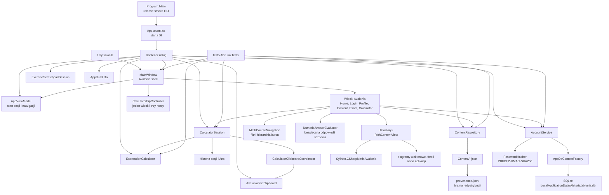

# Architektura systemu Abituria

Ten dokument opisuje aktualną architekturę aplikacji Abituria po migracji z WPF do AvaloniaUI. Historyczny opis struktury systemu pozostaje w `docs/legacy/opis-struktury-systemu.md`, ale nie jest już opisem bieżącego kodu.

## Podsumowanie techniczne

Abituria jest lokalną aplikacją desktopową `.NET 10 LTS` z interfejsem AvaloniaUI 12. Aplikacja działa offline, przechowuje dane kont i postęp w SQLite, a treści edukacyjne oraz dłuższe opisy interfejsu wczytuje z plików JSON umieszczonych w katalogu `Content`.

Najważniejsze decyzje architektoniczne:

- jedno główne okno `MainWindow`, nawigacja przez podmianę kontrolek `UserControl` i jeden kontrolowany host kalkulatora PiP,
- brak aktywnej nawigacji WPF, `Page`, `Frame` i `NavigationWindow`,
- ręczna kompozycja widoków w C# zamiast rozbudowanych hierarchii XAML,
- usługi aplikacyjne rejestrowane w prostym kontenerze DI z `Microsoft.Extensions.DependencyInjection`,
- lokalna baza SQLite przez Entity Framework Core,
- kalkulatory jako logika domenowa niezależna od UI,
- treści statyczne poza kodem produkcyjnym,
- zasoby motywu i stany interakcji współdzielone przez wszystkie widoki,
- adaptacyjne układy oparte na szerokości rzeczywistego widoku, a nie na wykrywaniu systemu operacyjnego.

## Diagram komponentów

```mermaid
flowchart TB
    User["Użytkownik"] --> Window["MainWindow<br/>Avalonia shell"]

    App["App.axaml.cs<br/>start i DI"] --> Services["Kontener usług"]
    Cli["Program.Main<br/>release smoke CLI"] --> App
    Services --> Window
    Services --> ViewModel["AppViewModel<br/>stan sesji i nawigacji"]
    Services --> Accounts["AccountService"]
    Services --> Content["ContentRepository"]
    Services --> CalculatorSession["CalculatorSession"]
    Services --> ExpressionCalculator["ExpressionCalculator"]
    Services --> Clipboard["AvaloniaTextClipboard"]
    Services --> Scratchpads["ExerciseScratchpadSession"]
    Services --> BuildInfo["AppBuildInfo"]

    Window --> ViewModel
    Window --> Views["Widoki Avalonia<br/>Home, Login, Profile, Content, Exam, Calculator"]
    Window --> Pip["CalculatorPipController<br/>jeden widok i trzy hosty"]
    Views --> Ui["UiFactory i RichContentView"]
    Views --> Accounts
    Views --> Content
    Views --> CourseNavigation["MathCourseNavigation<br/>filtr i hierarchia kursu"]
    Views --> NumericAnswers["NumericAnswerEvaluator<br/>bezpieczna odpowiedź liczbowa"]
    Views --> CalculatorSession

    CalculatorSession --> ExpressionCalculator
    CalculatorSession --> CalculatorHistory["Historia sesji i Ans"]
    CalculatorSession --> ClipboardCoordinator["CalculatorClipboardCoordinator"]
    ClipboardCoordinator --> Clipboard

    Content --> Json["Content/*.json"]
    Json --> Provenance["provenance.json<br/>brama redystrybucji"]
    Ui --> Math["Sylinko.CSharpMath.Avalonia"]
    Ui --> Assets["diagramy wektorowe, font i ikona aplikacji"]

    Accounts --> DbFactory["AppDbContextFactory"]
    DbFactory --> SQLite["SQLite<br/>LocalApplicationData/Abituria/abituria.db"]
    Accounts --> Passwords["PasswordHasher<br/>PBKDF2-HMAC-SHA256"]

    Tests["tests/Abituria.Tests"] --> Window
    Tests --> Accounts
    Tests --> Content
    Tests --> CalculatorSession
    Tests --> ExpressionCalculator
```

## Warstwy i katalogi

| Katalog | Odpowiedzialność | Przykłady |
| --- | --- | --- |
| `AvaloniaApp` | Kod aplikacji desktopowej | `App.axaml.cs`, `MainWindow.axaml.cs`, `Program.cs` |
| `AvaloniaApp/Models` | Kontrakty danych i modeli treści | `MathCourseCatalog`, `LearningExercise`, `ExamDefinition`, `LocalProfile` |
| `AvaloniaApp/Data` | SQLite, encje EF Core i migracje | `AppDbContext`, `AppDbContextFactory`, `InitialLocalAccounts` |
| `AvaloniaApp/Services` | Logika aplikacyjna, domenowa i uruchomieniowa | konta, hasła, repozytorium treści, kalkulatory, informacje o buildzie, smoke test |
| `AvaloniaApp/ViewModels` | Stan sesji i wybór strony | `AppViewModel`, `AppPage` |
| `AvaloniaApp/Views` | Ekrany Avalonia | logowanie, profil, zadania, treści, kalkulatory |
| `AvaloniaApp/Ui` | Wspólne budowanie UI i rich content | `UiFactory`, `RichContentView` |
| `Content` | Dane edukacyjne, teksty interfejsu i inwentarz pochodzenia | wzory, działy, zadania, roadmapa, komunikaty, `provenance.json` |
| `docs` | Dokumentacja aktywna i archiwum legacy | architektura, migracja, SonarQube, treści |
| `tests/Abituria.Tests` | Regresje jednostkowe, integracyjne i headless UI | parser, konta, routing, wizualne listy matematyczne |

## Uruchomienie i kompozycja aplikacji

`Program.Main` rozdziela dwa jawne tryby. Bez parametrów tworzy `AppBuilder` i uruchamia klasyczny cykl życia desktopowego. Parametry `--release-smoke-test --data-directory <katalog>` uruchamiają diagnostykę wydania bez głównego okna. Oba tryby korzystają z tej samej rejestracji `AddAbituriaServices`, więc testuje się rzeczywisty graf usług aplikacji.

`App.OnFrameworkInitializationCompleted` buduje kontener DI z następującymi usługami:

- `AppDbContextFactory`,
- `PasswordHasher`,
- `AccountService`,
- `ContentRepository`,
- `ExpressionCalculator`,
- `ExerciseRandomizer`,
- `CalculatorSession`,
- `AvaloniaTextClipboard`,
- `ExerciseScratchpadSession`,
- `AppBuildInfo`,
- `AppViewModel`,
- `MainWindow`.

Po utworzeniu kontenera aplikacja inicjalizuje konta i w trybie desktopowym ustawia `MainWindow` jako główne okno. `CalculatorPipController` może utworzyć najwyżej jedno małe okno należące do `MainWindow`; alternatywnie hostuje ten sam widok jako panel wewnątrz głównego okna. Tryb diagnostyczny kieruje bazę do jawnie przekazanego katalogu tymczasowego, wyłącza import `%APPDATA%/Abituria/users.txt`, nie tworzy okna i sprawdza zasoby, SQLite, profil gościa, kalkulator oraz informacje o buildzie.

## Nawigacja i shell UI

`MainWindow` zawiera jeden `ShellHost`. Gdy użytkownik nie jest zalogowany, host otrzymuje `LoginView`. Po zalogowaniu `MainWindow` buduje górny pasek nawigacji i aktualną stronę na podstawie `AppViewModel.CurrentPage`.

Stan nawigacji jest scentralizowany w `AppViewModel`:

- `Login` ustawia aktywny profil i przechodzi do strony startowej,
- `Navigate` blokuje dostęp do stron, gdy nie ma aktywnego profilu,
- `OpenFormula`, `OpenCourseArea`, `OpenCourseLesson`, `OpenExercise`, `OpenTopic`, `OpenRoadmap` i `OpenPlaceholder` zapisują kontekst wybranej strony,
- `OpenRandomExercise` zapisuje wylosowane zadanie i zachowuje kontekst całego arkusza albo wybranego tematu,
- `OpenGeneralCalculator` przełącza z huba kalkulatorów na kalkulator ogólny.

Widoki są zwykłymi kontrolkami Avalonia `UserControl`. Produkcyjny kod nie używa WPF `Page`, `Frame` ani `NavigationWindow`. Regresja `NavigationArchitectureTests` dopuszcza dokładnie jeden kontrolowany wyjątek od zakazu okien niemodalnych: `CalculatorPipController`, który przechowuje pojedynczą instancję okna i widoku, ustawia właściciela oraz nie pokazuje PiP na pasku zadań.

### Własny chrome okna

`MainWindow` wyłącza dekoracje systemowe przez `WindowDecorations="None"`, czyli aktualny mechanizm Avalonia 12 zastępujący starsze `SystemDecorations`, i rozszerza obszar klienta na pasek tytułu. Własny chrome składa się z:

- obszaru przeciągania wywołującego `BeginMoveDrag`;
- dwukliku przełączającego `WindowState` między `Normal` i `FullScreen`;
- historycznych przycisków emoji po lewej: `🍓` zamyka, `🍋` włącza pełny ekran lub przywraca okno, a `🍏` minimalizuje okno;
- wyśrodkowanej marki `🍀 Abituria` oraz przycisku motywu wyrównanego do prawej;
- ośmiu przezroczystych uchwytów wywołujących `BeginResizeDrag` dla czterech krawędzi i czterech narożników;
- aktualizacji tooltipu i nazwy automatyzacji przycisku `🍋` po zmianie stanu okna, bez zastępowania historycznego emoji standardowym glyphem.

Emoji są znakami Unicode renderowanymi przez font platformy. Archiwalne `close.png`, `max.png` i `min.png` nie są zasobami uruchomieniowymi. `FullScreen` wykorzystuje pełny obszar ekranu, więc na Windows nie pozostawia systemowego paska zadań nad aplikacją. Uchwyty są aktywne tylko dla zwykłego, skalowalnego okna. Każdy widoczny przycisk chrome ma tooltip z opóźnieniem `250 ms`, `AutomationId`, opisową nazwę i jawny stan `focus-visible`.

### Motywy i zasoby wizualne

`AppStyles.axaml` zawiera font Mulish, wspólne style oraz słowniki wariantu jasnego i ciemnego. `AppThemeManager` przełącza ustawienie systemowe, jasne, ciemne i wysokiego kontrastu oraz reaguje na zmianę preferencji kontrastu platformy. Tryb wysokiego kontrastu podstawia dynamiczne zasoby palety bez przebudowania widoku.

Kolory w widokach są wiązane przez `DynamicResource`. `UiFactory` przypisuje semantyczne klucze, takie jak `SurfaceBrush`, `TextPrimaryBrush`, `SuccessBrush` i `ErrorBrush`; aktywne widoki nie utrzymują własnych literałów kolorów. Dzięki temu komunikaty i karty zmieniają kolor razem z motywem.

Style przycisków, pól tekstowych i pól wyboru definiują osobno `:pointerover`, `:pressed`, `:focus` oraz `:focus-visible`. Stan klawiaturowego fokusu używa kontrastowej ramki. Palety i zasady ich weryfikacji opisuje `ACCESSIBILITY_WCAG_AUDIT.md`.

### Układy adaptacyjne i dialogi

`AdaptiveLayout.ObserveWidth` obserwuje rzeczywistą szerokość kontrolki i przełącza ten sam logiczny zestaw dzieci między wariantem szerokim i kompaktowym:

- `LoginView` przechodzi z dwóch kolumn do dwóch wierszy poniżej `860`;
- `HomeView` przechodzi z dwóch kolumn kafli do jednej poniżej `780`;
- `GeneralCalculatorView` przenosi historię pod kalkulator poniżej `900`.

Zmiana `Grid.Row` i `Grid.Column` nie zmienia kolejności dzieci w drzewie logicznym, dlatego reflow nie powinien zmieniać kolejności klawiaturowej ani automatyzacji.

`AdaptiveLayout.CreateDialog` tworzy wspólny, modalny dialog kodu odzyskiwania z `CanResize=true`, zakresem `340x220` do `720x640`, wymiarem początkowym zależnym od właściciela i pionowym przewijaniem. Login i Profil używają tej samej fabryki zamiast stałych, nieskalowalnych okien.

## Konta, bezpieczeństwo i dane lokalne

`AccountService` obsługuje:

- inicjalizację bazy,
- import historycznych profili gościa z `%APPDATA%/Abituria/users.txt`,
- domyślny profil gościa,
- rejestrację lokalnego konta,
- logowanie,
- odzyskiwanie hasła,
- zmianę hasła,
- zapis ukończonych zadań,
- odczyt i zapis trybu kalkulatora PiP z walidacją wartości enum.

Dane trwałe są zapisywane w SQLite w katalogu `LocalApplicationData/Abituria/abituria.db`. Migracja `202607310001_AddProfilePipPreference` dodaje ustawienie trybu PiP z bezpieczną wartością domyślną `OwnedWindow`. Hasła są haszowane przez `PasswordHasher` z PBKDF2-HMAC-SHA256, osobną solą i wersjonowaną liczbą iteracji. Kod odzyskiwania jest pokazywany użytkownikowi tylko raz, a w bazie pozostaje jego skrót. Brudnopis korzysta z `ExerciseScratchpadSession`, jest indeksowany identyfikatorem profilu i zadania oraz celowo nie trafia do SQLite.

## Treści edukacyjne

`ContentRepository` ładuje zasoby JSON z `Content` jako zasoby Avalonia:

- `formulas.json` - tablice matematyczne,
- `chapters.json` - hierarchiczny kurs Formuły 2023: źródła, grupy, obszary, wymagania, lekcje i przykłady,
- `course-exercises.json` - ćwiczenia kursowe korzystające ze wspólnego modelu `LearningExercise`,
- `official-course-examples.json` - 97 przykładów CKE w osobnej warstwie źródłowej z numerami, stronami, wymaganiami, rozwiązaniami i opisami figur,
- `exams.json` - uporządkowany indeks aktywnych arkuszy i 17 wspólnych tematów,
- `exam-2023-main-basic.json` - matura główna 2023 PP w schemacie 4: 31 zadań, 34 części, 46 punktów, odpowiedzi, rozwiązania, kryteria i źródła,
- `exam-2023-correction-basic.json` - matura poprawkowa 2023 PP w schemacie 4: 33 zadania, 36 części, 46 punktów, odpowiedzi, rozwiązania, kryteria i źródła,
- `exam-2023-main-extended.json` - matura główna 2023 PR w schemacie 4: 13 zadań, 14 części, 50 punktów, odpowiedzi, rozwiązania, kryteria i źródła,
- `exam-2022-main-basic.json` - matura główna 2022 PP w Formule 2015 w schemacie 4: 35 zadań, 35 części, 45 punktów, odpowiedzi, rozwiązania, kryteria i źródła,
- `exam-2022-main-extended.json` - matura główna 2022 PR w Formule 2015 w schemacie 4: 15 zadań, 15 części, 50 punktów, odpowiedzi, rozwiązania, kryteria i źródła,
- `exam-2022-correction-basic.json` - matura poprawkowa 2022 PP w Formule 2015 w schemacie 4: 35 zadań, 35 części, 45 punktów, odpowiedzi, rozwiązania, kryteria i źródła,
- `exam-2024-correction-basic.json` - matura poprawkowa 2024 PP w schemacie 4: 30 zadań, 36 części, 46 punktów, odpowiedzi, rozwiązania, kryteria i źródła,
- `exam-2025-main-basic.json` - matura główna 2025 PP w schemacie 4: 31 zadań, 35 części, 50 punktów, odpowiedzi, rozwiązania, kryteria i źródła,
- `exam-2025-main-extended.json` - matura główna 2025 PR w schemacie 4: 12 zadań, 13 części, 50 punktów, odpowiedzi, rozwiązania, kryteria i źródła,
- `exam-2025-correction-basic.json` - matura poprawkowa 2025 PP w schemacie 4: 31 zadań, 36 części, 50 punktów, odpowiedzi, rozwiązania, kryteria i źródła,
- `exam-2024-main-basic.json` - matura główna 2024 PP w schemacie 4: 31 zadań, 35 części, 46 punktów, odpowiedzi, rozwiązania, kryteria i źródła,
- `exam-2024-main-extended.json` - matura główna 2024 PR w schemacie 4: 13 zadań, 14 części, 50 punktów, odpowiedzi, rozwiązania, kryteria i źródła,
- `exam-2026-main-basic.json` - matura główna 2026 PP w schemacie 4: 33 zadania, 37 części, 50 punktów, odpowiedzi, rozwiązania, kryteria i źródła,
- `exam-2026-main-extended.json` - matura główna 2026 PR w schemacie 4: 12 zadań, 13 części, 50 punktów, odpowiedzi, rozwiązania, kryteria i źródła,
- `exam-2021-correction.json` - zgodny wstecznie arkusz poprawkowy 2021 w schemacie 3,
- `exam-2018-main-basic.json` - matura główna 2018 PP w Formule 2015 w schemacie 4: 34 zadania, 34 części, 50 punktów, odpowiedzi, rozwiązania, kryteria i źródła,
- `exam-2018-main-extended.json` - matura główna 2018 PR w Formule 2015 w schemacie 4: 15 zadań, 15 części, 50 punktów, odpowiedzi, rozwiązania, kryteria i źródła,
- `exam-2018-correction-basic.json` - matura poprawkowa 2018 PP w Formule 2015 w schemacie 4: 34 zadania, 34 części, 50 punktów, odpowiedzi, rozwiązania, kryteria i źródła,
- `exam-2019-main-basic.json` - matura główna 2019 PP w Formule 2015 w schemacie 4: 34 zadania, 34 części, 50 punktów, odpowiedzi, rozwiązania, kryteria i źródła,
- `exam-2019-main-extended.json` - matura główna 2019 PR w Formule 2015 w schemacie 4: 15 zadań, 15 części, 50 punktów, odpowiedzi, rozwiązania, kryteria i źródła,
- `exam-2019-correction-basic.json` - matura poprawkowa 2019 PP w Formule 2015 w schemacie 4: 34 zadania, 34 części, 50 punktów, odpowiedzi, rozwiązania, kryteria i źródła,
- `exam-2020-main-basic.json` - matura główna 2020 PP w Formule 2015 w schemacie 4: 34 zadania, 34 części, 50 punktów, odpowiedzi, rozwiązania, kryteria i źródła,
- `exam-2020-main-extended.json` - matura główna 2020 PR w Formule 2015 w schemacie 4: 15 zadań, 15 części, 50 punktów, odpowiedzi, rozwiązania, kryteria i źródła,
- `exam-2020-correction-basic.json` - matura poprawkowa 2020 PP w Formule 2015 w schemacie 4: 34 zadania, 34 części, 50 punktów, odpowiedzi, rozwiązania, kryteria i źródła,
- `diagrams.json` - 195 deterministycznych diagramów wektorowych, w tym 147 figur matur 2018, 2019, 2020, 2021, 2022, 2023, 2024, 2025 i 2026 ze stroną źródłową,
- `placeholders.json` - jawne placeholdery funkcji,
- `roadmap.json` - plan rozwoju,
- `ui-copy.json` - dłuższe statyczne teksty interfejsu.
- `provenance.json` - autor, źródło, licencja i status redystrybucji każdego paczkowanego zasobu.

Kod produkcyjny odpowiada za wczytanie i wyświetlenie treści, a nie za przechowywanie długich materiałów edukacyjnych. `ContentRepository.Exams` zachowuje kolejność aktywnego indeksu, `GetExam(id)` wybiera arkusz, a `GetTopicExercises(topicId)` agreguje zadania z dwudziestu sześciu arkuszy bez zmiany identyfikatorów `mp21-*`. `ExamCatalogValidator` sprawdza indeks, metadane, globalną unikalność identyfikatorów, kolejność, tematy i umowy odpowiedzi.

`MathCourseNavigation` realizuje filtr podstawowy/rozszerzony i hierarchię obszar - lekcja - ćwiczenie. `OfficialCourseExampleCatalogValidator` porównuje źródła z przypiętymi źródłami kursu, sprawdza liczniki, strony, mapowania wymagań i opisy figur. `CourseLessonView` zachowuje autorskie przykłady jako pierwszą warstwę, a transkrypcje CKE prezentuje niżej w zwiniętych kartach bez wpływu na postęp i SQLite. `NumericAnswerEvaluator` przekazuje wyrażenia do bezpiecznego parsera kalkulatora, obsługuje przecinek lub kropkę, tolerancję bezwzględną i względną oraz odrzuca błędy i wartości niefinitywne. `CompoundAnswerEvaluator` łączy części wyboru, liczbowe i tekstowe; zadanie zostaje ukończone dopiero po poprawnym wypełnieniu wszystkich pól. Renderowanie treści miesza zwykłe `TextBlock`, skalowalne `DiagramView` oraz `MathView` z `Sylinko.CSharpMath.Avalonia`.

Profil nadal zapisuje wyłącznie identyfikatory ukończonych ćwiczeń w istniejącej tabeli SQLite. Liczniki `x/37`, sześć liczników `x/35`, dwa liczniki `x/13`, dwa liczniki `x/14`, trzy liczniki `x/36`, siedem liczników `x/34` i pięć liczników `x/15` są wyliczane przez przecięcie tego zbioru z identyfikatorami każdego arkusza, dlatego nie jest potrzebna nowa migracja bazy.

`DiagramView` materializuje prymitywy katalogu jako kontrolki `Line`, `Polyline`, `Polygon`, `Ellipse` i `TextBlock` Avalonia. Łuki są deterministycznie aproksymowane poliliniami, a `Viewbox` skaluje całość bez utraty proporcji. 147 figur matur 2018, 2019, 2020, 2021, 2022, 2023, 2024, 2025 i 2026 używa wyłącznie tego wektorowego przepływu i nie tworzy `Image`, `Bitmap` ani aktywnych rastrów.

Manifest pochodzenia jest porównywany z zasobami zadeklarowanymi w `Abituria.csproj`. Testy wymagają dokładnie jednego wpisu dla każdego pliku, kompletnego autora, źródła, licencji lub podstawy dystrybucji i istniejących dowodów. Status `blocked` nie psuje lokalnej kompilacji, ale `Test-ContentProvenance.ps1 -RequireReleaseEligible` bezwarunkowo blokuje publiczne wydanie.

## Kalkulatory

Kalkulator funkcji kwadratowej korzysta z `QuadraticSolver`. Kalkulator ogólny składa się z trzech części:

- `ExpressionCalculator` - tokenizer, parser i ewaluator wyrażeń,
- `CalculatorSession` - historia, `Ans` i powtarzanie operacji,
- `CalculatorInputState` - semantyka wejścia po wyniku, błędzie, `=`, `1/x`, pierwiastku i `x²`.

Pełny ekran i kompaktowy PiP korzystają z tego samego `GeneralCalculatorView`. `CalculatorPipController` przenosi tę samą kontrolkę między oknem należącym do Abiturii, oknem `Topmost` i panelem w prawym dolnym rogu, więc wyrażenie oraz `CalculatorSession` nie są zerowane przy zmianie trybu. Ustawienie wybiera się na stronie `Opcje` i zapisuje osobno dla profilu.

`CalculatorSession` publikuje zdarzenie wyłącznie po poprawnym wyniku. `CalculatorClipboardCoordinator` szereguje asynchroniczne zapisy, aby szybkie obliczenia nie odwróciły kolejności wartości `Ans`. `AvaloniaTextClipboard` izoluje dostęp do schowka platformy i zwraca kontrolowany komunikat zamiast przerywać obliczenie. `TextBoxClipboardBehavior` zapewnia wspólne wklejanie w brudnopisie i odpowiedzi liczbowej z zachowaniem kursora oraz zaznaczenia.

`ExerciseRandomizer` wybiera jedno zadanie z przekazanej, niezmienianej puli. Widok listy przekazuje kontekst całego arkusza albo konkretnego tematu do `AppViewModel`, dzięki czemu przyciski poprzedniego i następnego zadania nie opuszczają wylosowanej puli.

Logika obliczeń nie zależy od Avalonia. Widoki tylko zbierają wejście użytkownika, wywołują usługi i prezentują wynik albo błąd.

## Testy i jakość

Projekt ma testy dla głównych warstw:

- `AccountServiceTests` - konta, hasła, import, postęp,
- `ExpressionCalculator*Tests` - parser, błędy, pierwiastki, potęgi, notacja naukowa, kombinacje,
- `CalculatorSessionTests`, `HistorySemanticsTests`, `RepeatedEqualsTests` - historia, `Ans` i powtarzanie `=`,
- `NavigationArchitectureTests` - brak powrotu do WPF i niekontrolowanego otwierania okien,
- `ExerciseAndRoutingCoverageTests` - headless UI dla routingu i zadań,
- `Discussion10VisualRegressionTests` - układ inline, listy matematyczne i regresje wizualne,
- `Discussion49StyleRegressionTests` - font, własny chrome, stany interakcji, widoczny fokus, motywy, breakpointy, dialogi i koszt renderowania,
- `ReleaseRuntimeTests`, `AboutViewTests` - izolowany smoke test, metadane builda i ekran "O programie",
- `ContentProvenanceTests` - kompletność i jednoznaczność pochodzenia paczkowanych zasobów,
- `MathCourse2023ContentTests` - kontrakt `4/13/73/46/238/357`, generowanie, filtr, tryby odpowiedzi, postęp, opisy alternatywne i rozmiary UI,
- `OfficialCourseExampleContentTests` i `test_import_cke_informer_examples.py` - kontrakt `66/31/97`, przypięte źródła, komplet transkrypcji, mapowania wymagań, opisy 53 figur, rozdzielenie warstw UI i deterministyczny importer,
- `Matura2018ContentTests`, `Matura2019ContentTests`, `Matura2020BasicContentTests`, `Matura2020ExtendedContentTests`, `Matura2020CorrectionBasicContentTests`, `Matura2021BasicContentTests`, `Matura2021ExtendedContentTests`, `Matura2022BasicContentTests`, `Matura2022ExtendedContentTests`, `Matura2022CorrectionBasicContentTests`, `Matura2023BasicContentTests`, `Matura2023CorrectionBasicContentTests`, `Matura2023ExtendedContentTests`, `Matura2024BasicContentTests`, `Matura2024CorrectionBasicContentTests`, `Matura2024ExtendedContentTests`, `Matura2025ContentTests`, `Matura2025ExtendedContentTests`, `Matura2025CorrectionBasicContentTests`, `Matura2026ContentTests`, `Matura2026ExtendedContentTests`, `Matura2026UiTests`, `CompoundAnswerEvaluatorTests` - kontrakty matur 2018 `34/34/50`, `15/15/50` i `34/34/50`, matur 2019 `34/34/50`, `15/15/50` i `34/34/50`, matur 2020 `34/34/50`, `15/15/50` i `34/34/50`, matur 2021 `35/35/45` i `15/15/50`, matur 2022 `35/35/45`, `15/15/50` i `35/35/45`, matur 2023 `31/34/46`, `33/36/46`, `13/14/50`, matur 2024 `31/35/46`, `30/36/46`, `13/14/50`, matur 2025 `31/35/50`, `12/13/50`, `31/36/50` oraz matur 2026 `33/37/50`, `12/13/50`, źródła i SHA-256, dwadzieścia sześć arkuszy oraz `722` jednostki postępu, agregacja tematów, odpowiedzi złożone i oddzielny postęp,
- `Issue5CalculatorPipTests` - PiP, ustawienia profilu, kolejność schowka, wklejanie, sesyjny brudnopis, motywy i rozmiary UI.

CI używa workflow `build` do restore, build oraz testów C# i Pythona. Raporty OpenCover i Cobertura trafiają do wspólnej bramki wymagającej `90%` łącznego pokrycia i `85%` pokrycia gałęzi. Dodatkowy workflow `sonarcloud` uruchamia wielojęzyczny SonarScanner for .NET, przekazuje oba raporty i czeka na quality gate. Workflow wydania działa na natywnych runnerach Windows, Ubuntu i macOS: odtwarza lockfile, audytuje NuGet, publikuje self-contained, wykonuje smoke test, sprawdza architekturę i zawartość archiwów oraz generuje sumy SHA-256, SBOM i atestacje. GitHub Pages powstaje z tych samych plików Markdown przez DocFX.

## Różnice względem historycznego opisu systemu

Historyczne issue #33 opisywało plan oparty o WPF i częściowo nieprecyzyjne rozdzielenie frontend/backend. Obecny system różni się w praktyce:

- WPF zostało zastąpione przez AvaloniaUI,
- SQL Server lub LocalDB zostały zastąpione przez lokalne SQLite,
- kalkulator ogólny jest zrealizowany jako parser wyrażeń, a nie operacje na fragmentach tekstu,
- dokumenty projektowe są zachowane w `docs/legacy`, ale aktywna architektura jest opisana w tym pliku, README i inwentarzu migracji,
- długie treści i wzory są odseparowane od kodu w plikach JSON.

## Powiązane dokumenty

- `README.md` - uruchomienie, funkcje i skrócona struktura,
- `docs/BUSINESS_ANALYSIS.md` - uzasadnienie produktu, interesariusze, model udostępniania, ryzyka i kamienie milowe,
- `docs/REQUIREMENTS.md` - aktywny dokument wymagań projektowych,
- `docs/ACCESSIBILITY_WCAG_AUDIT.md` - pełna macierz WCAG 2.2 A/AA i ograniczenia dowodów,
- `docs/MIGRATION_INVENTORY.md` - mapowanie starych wersji WPF na aktualny kod Avalonia,
- `docs/CONTENT_AUTHORING.md` - zasady edycji treści i podglądu materiałów,
- `docs/CALCULATOR_TEST_MATRIX.md` - macierz regresji kalkulatora,
- `docs/SONARQUBE.md` - konfiguracja SonarQube Cloud i SonarQube for Visual Studio,
- `docs/legacy/README.md` - indeks historycznych dokumentów projektu.
